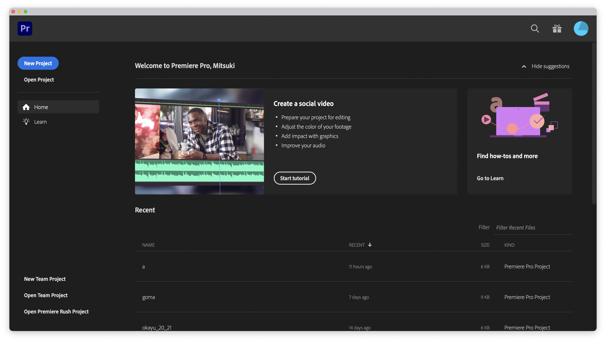
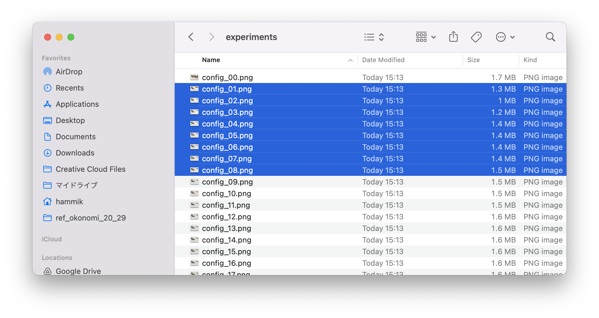

# Non-Newtonian ViRheometry via Similarity Analysis

We provide a reference implementation (with data) for the paper "Non-Newtonian ViRheometry via Similarity Analysis,"
in the hope that it will be useful, but WITHOUT ANY WARRANTY; without even the implied warranty of MERCHANTABILITY or FITNESS FOR A PARTICULAR PURPOSE.
We are porting the [marching cubes implementation by Thomas Lewiner](https://github.com/neurolabusc/LewinerMarchingCubes.git) and the [particle skinner code by Haimasree Bhattacharya and Adam Bargteil](https://github.com/haimasree/particleskinner) (with modification) for skinning the simulated particles. They are provided (redistributed) together for the ease to reproduce our results.

The code used in our paper also runs on Ubuntu, but the reference implementation provided here currently only contains a version that works on macOS.
(There might be a slight difference in the optimized results when running on a macOS environment.)

<!--  -->

<div align="center">  

<!-- []()
[]()
[]() -->

</div>

## Dependencies

The code provided here assumes the Python 3.11 environment (set up using brew, running on a macOS system) with the following packages.

[Python packages]
- NumPy
- SciPy
- matplotlib
- pandas
- taichi


[Additional dependencies]
- boost-python3
- eigen
- opencv
- cmake
- libcmaes
- OpenGL


## How to build
On macOS M1 and later, you need to use Rosetta.

If you haven't installed brew yet, please run the following command:

```shell
/bin/bash -c "$(curl -fsSL https://raw.githubusercontent.com/Homebrew/install/HEAD/install.sh)"\n
 (echo; echo 'eval "$(/usr/local/bin/brew shellenv)"') >> /Users/$USER/.zprofile
 eval "$(/usr/local/bin/brew shellenv)"\n
```

After installing brew, you need to restart the terminal.  
For setting up the environment:
```shell
sh libs/auto_setup.sh
```
For compiling renderer and particle skinner:
```shell
sh libs/build.sh "mac"
```


## Run
### [0_make_experimental_device]

For creating the experimental device, use a laser cutter for 'bottom_plate.pdf' and 'side_wall.pdf' to create the bottom plate and side plates, respectively. 

### Codes for generating the landspaces and for learning the conversion map will be provided later on.

### [4_propose_initial_setup]
To generate the first setup (width and height), the corresponding setting file, and the working directory for estimation:
```shell
cd 4_propose_initial_setup
python3 propose_initial_setup.py -d [density] -m [material name]
```
The generated directory is located in 'data/ref\_[material name]\_[height]\_[width]_1.

*Note: The optimization setting files and directories used in the paper are located in 'data/real_world_experiment*   

### [5_calibration]
Premier Pro, Photoshop, Blender and fSpy are used for calibration.  
Premier Pro : https://www.adobe.com/products/premiere.html
photoshop : https://www.adobe.com/products/photoshop.html   
Blender : https://www.blender.org  
fSpy : https://fspy.io   
fSpy (Blender add-on) : https://github.com/stuffmatic/fSpy-Blender/releases/tag/v1.0.3


#### Premier Pro
In Premiere Pro, you can export the recorded (slo-mo) experimental video as an image sequence.

1. When you launch Premiere Pro, please click on "New Project" in the top left corner.

2. Click on "Create" in the bottom right corner to create a new project.

3. Drag and drop the recorded video into the "Import media to start" area in the bottom left.


4. You should set the in-point and out-point as follows:
 - The in-point should be at the frame where the bottom of the front panel is closest to height/2.
 - The interval between the in-point and out-point should be at least 1/3 of a second.

5. To export frames, *File > Export > Media*.

6. Please configure the export settings as follows and proceed with the export:
- File Name: config_.png
- Location: Please create a folder for exporting.
- Format: PNG
- Export As Sequence: Check this option.
- Frame Rate: 24

7. Image sequences has been generated in the export folder.


#### fSpy
After capturing images for calibration using a checker pattern, you can perform calibration using fSpy.


Please configure fSpy settings as follows:
- Number of vanishing points: 2
- Vanishing point axes: 1:y, 2:x
- Reference distance: 6cm along the x axis
- Sensor: 36 × 20.25 (this setting may depend on the mobile phone used to shoot the slo-mo video)
- Focal length: Camera dependent

the two lines shown run 1) along the vertical direction and 2) the horizontal direction of the checker pattern. Additionally, set the origin to the bottom-right front vertex of the cuboid region of the specimen.

#### Blender
To generate camera parameters for rendering, you can use the Blender and fSpy file created in the previous step.

1. Import fSpy file by *File > Import > fSpy (.fSpy)*. 


2. Select the fSpy file, 
- open the "Object Data Properties" in Properties (bottom right) and change the "Opacity" to 0.3 and the "Depth" to "Front" .
-  change "XYZ Euler" to "Quaternion (WXYZ)" in Sidebar.


3. Press Shift + A, select *Mesh > Cube*, and set "Dimensions" to X=Width, Y=4cm, Z=Height. Set "Location" to X = -Width / 2.0, Y = 2.0, Z = Height / 2.0


4. Change the name of fSpy camera to "Cam_[filename].fspy" and rename the Cube to "Obj_Cube" in Blender.


5. From the workspace tab at the top of the window, select a workspace other than "Layout" (i.e. "Modeling"). Then, open the "Text Editor" from the "Editor Type" in the top-left corner and open the file "5_calibration/export_camera_params_using_blender.py."


6. In the "Outliner" (top right), select both "Cam_[filename].fspy" and "Obj_Cube". Then, press the "Run Script" to generate camera parameters. A file browser will open simultaneously, and please select the folder that you created during "4_propose_initial_setup" as the export destination. 

The camera_params.xml is generated.


7. Save the Blender editing screen for reference in the Photoshop image binarization process.  
*Layout > View  > Viewport Render Image > Image > Save As > Save As Image*


*Note: as a sanity check of the calibration process, please render the cuboid region (of the specimen) using the GLRender3d code with the calibrated camera parameters to see if the rendered region agrees with the cuboid region (of the specimen) in the captured frames.

#### photoshop
Perform cropping and binarization on the image sequence generated in Premiere Pro. (The idea is to work with the last frame (config_08.png) together with the initial condition (Blender editing screen image) to have a rough estimate of the necessary region (as the union of the fluid regions in these two images).)
1. Open the image named "config_08.png"


2. Open Blender editing screen image for reference.


3. Overlay two layers. Then, open the "Blending Options" and reduce the "Opacity" of the Blender's Screen layer.


4. select Layer1 and generate an action.

5. Crop the fluid's region. Using the Polygonal Lasso tool, select the region.


6. *Select > Inverse* and click delete key for removing the unnecessary outer area.


7. Stop recording the action, delete Blender's screen layer.

8. Resume the recording and deselecting.

9. binarize the image. *Image > Adjustments > Threshold*


10. Make new Layer and fill it white (or black).


11. Merge Layers and save to export folder.


12. For adding "Open" action, you should open file. Then, move the "Open" action to the top of the actions list.


13. The configuration of actions is as follows:

14. Perform batch processing. *Automate > Batch*

15. check "Override Action "Open" Commands" and "Override Action "Save As" Commands". Then, Specify source folder and destination folder.

16. the binarized images are generated in destination folder.


### [6_optimization]
To estimate the material parameters with the first setup:
```shell
cd 6_optimization
python3 herschel_bulkley_parameter_estimation_for_1st_setup.py -f ../data/ref_[material name]_[height]_[width]_1
```

At the end of the optimization using the first setup, a folder for the optimization using the second (and first) setup will be automatically created. The binary images from the experiment using the second setup and the calibration file for the second setup should be placed in this directory.   

The optimization results are output to the terminal, and they are also written to the "initial_material" in the "settings.xml" file in that folder.

*Note: If you see a popup message like "1002exec_taichi can’t be opened because (null) is not allowed to open documents in Terminal" at runtime, please try running it again.* 

*Note: results of optimization may depend on machine environment, so the selected second experimental setup may not be the same as that shown in the paper.*  

To estimate the material parameters with first and second setups:
```shell
python3 herschel_bulkley_parameter_estimation_for_2nd_setup.py -f ../data/ref_[material name]_[height]_[width]_1 -s ../data/ref_[material name]_[height]_[width]_2
```

At the end of this second optimization, a folder for the optimization using the third (together with the first and second) setup will be automatically created. The binary images from the experiment using the third setup and the calibration file for the thrid setup should be placed in this directory.   

To estimate the material parameters with first, second and third setups:
```shell
python3 herschel_bulkley_parameter_estimation_for_3rd_setup.py -f ../data/ref_[material name]_[height]_[width]_1 -s ../data/ref_[material name]_[height]_[width]_2 -t ../data/ref_[material name]_[height]_[width]_3
```

<!-- 
#### [1_make_loss]

Prepare for losslandscape generation:

```shell
cd 1_make_loss
sh prepare_make_loss.sh [FOLDER_NAME]
```
You should specify a working folder name into FOLDER_NAME.    
  
To start generating the losslandscapes:

```shell
sh auto_make_loss.sh [FOLDER_NAME]
```
The execution time of computing losslandscape can be considered long. On MacBook Pro (Apple M2), it takes 12 ~ 18 hours per one losslandscape.


#### [2_compute_PL]
For the next learning process, this process computes ground truth of PL value.  
As a sample case, We specifies a first argument as the directory containing the losses used in this paper.

```shell
python3 comute_c_curves.py "../data/sampleLossData/loss/*/"
```

#### [3_to_learn]
This is the learning process of loss similarity structure.

```shell
sh loearning_similarity_relation.sh ../2_compute_C/c_optimal.csv
``` -->


## Citing

```bibtex
@article{NNViRheometry,
author = {Hamamichi, Mitsuki and Nagasawa, Kentaro and Okada, Masato and Seto, Ryohei and Yue, Yonghao},
title = {Non-Newtonian ViRheometry via Similarity Analysis},
year = {2023},
issue_date = {December 2023},
publisher = {Association for Computing Machinery},
address = {New York, NY, USA},
volume = {42},
number = {6},
issn = {0730-0301},
url = {https://doi.org/10.1145/3618310},
doi = {10.1145/3618310},
journal = {ACM Trans. Graph.},
month = {dec},
articleno = {193},
numpages = {16},
}
```

## License

This project is released under [CC BY-NC 4.0 License](https://creativecommons.org/licenses/by-nc/4.0/).
